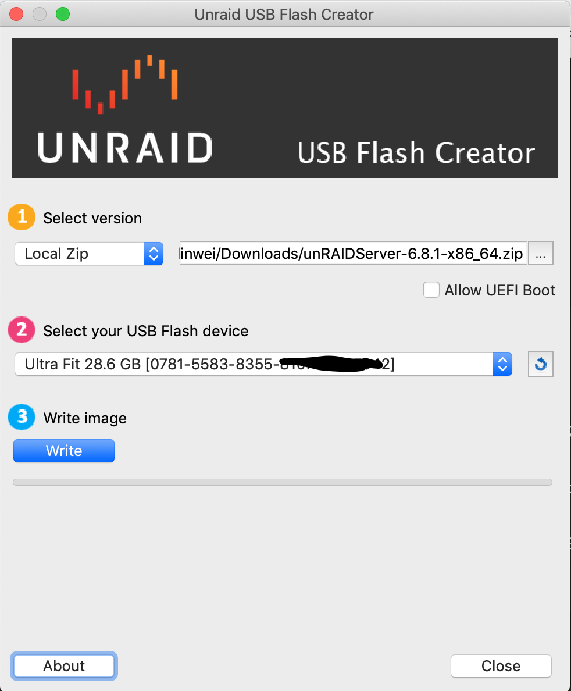

# 安装unraid

## 准备
- U盘一个（需要能识别出U盘UUID的，有些U盘识别不出来安装后不能用）
- PC机一台

## 安装步骤
- 从[官网](https://unraid.net/download)下载Unraid USB Creator以及最新的Unraid包（手动安装），并安装Unraid USB Creator。

- 打开Unraid USB Creator，并插入U盘（如下图）。


- 依次选择`Local zip`、下载Unraid包以及U盘（支持UEFI启动的机器可以勾选`Allow UEFI Boot`）。然后点击`Write`按钮将Unraid系统写入U盘。

- 在目标机器上插入U盘，并选择从U盘启动。    
Unraid启动成功后，会在底下显示字样
```
  Ipv4 address: 192.168.0.199
  Ipv6 address: not set

Tower login:
```
如果显示`Ipv4 address: not set`，说明网线没有插好，需要检查网络。

- 在浏览器中输入`http://192.168.0.199`(输入界面上对应的IP地址)，即可进入Unraid界面进行设置。

## 注意
最新的6.8.1版本和谐方法可以参考：https://softoroom.net/ptopic89043.html


